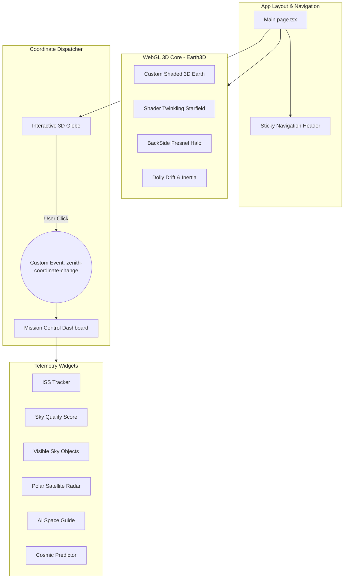
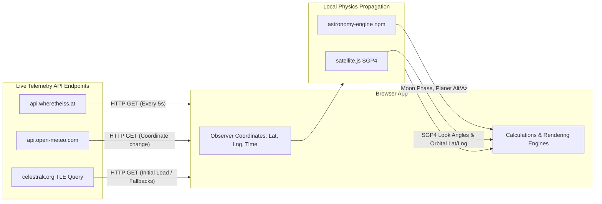

# 🌍 PROJECT ZENITH
### *The Celestial Eye — Real-Time Space Intelligence Dashboard*

[](https://nextjs.org)
[](https://threejs.org)
[](https://www.typescriptlang.org)
[](https://www.framer.com/motion)
[](LICENSE)

---

## 📋 Project Information

* **Team:** Royal Code Builders
* **Hackathon:** Project Zenith – The Celestial Eye (Round 2)
* **Live Demo:** [https://project-zenith-celestial-eye.netlify.app](https://project-zenith-celestial-eye.netlify.app)
* **GitHub**: [https://github.com/harshith7002/Project-Zenith](https://github.com/harshith7002/Project-Zenith)

---

> A cinematic, real-time cosmic radar that tracks satellites, celestial bodies, and space events — built with custom WebGL shaders, React Three Fiber, and live space APIs. Designed to deliver a smooth, highly optimized experience targeting 60 FPS on modern browsers.

---

## 🗺️ System Architecture & Data Flow

GitHub natively renders the Mermaid diagrams below to visualize how telemetry flows and synchronizes in Project Zenith.

### 1. Application Component Architecture
The following diagram illustrates how layout, state channels, WebGL rendering, and responsive widgets interface with each other:



### 2. Live API & Calculation Flow
This diagram details the unauthenticated endpoints and client-side physics engines driving real-time data calculations:



---

## ⚙️ Installation and Setup Instructions

This section outlines how to install and run the Project Zenith codebase locally on your machine.

### Prerequisites

| Requirement | Recommended Version | Purpose |
|---|---|---|
| **Node.js** | `18.x` or higher | JavaScript runtime |
| **npm** | `9.x` or higher | Package manager |
| **Internet Connection** | Active | To fetch CDN textures and query live unauthenticated API endpoints |

### Step-by-Step Local Setup

**1. Clone the repository**
```bash
git clone https://github.com/harshith7002/Project-Zenith.git
cd Project-Zenith
```

**2. Install dependencies**
Installs all UI rendering, math propagation, and design system packages:
```bash
npm install
```

**3. Run the local development server**
Starts the Next.js framework in development mode with HMR (Hot Module Replacement) enabled:
```bash
npm run dev
```

**4. View in Browser**
Open your web browser and navigate to:
```
http://localhost:3000
```

### Production Build & Optimization

To compile, lint, and run the optimized production bundle locally:
```bash
# Compile, lint, and check type safety (Webpack will bundle assets)
npm run build

# Start the optimized production server
npm start
```

---

## 🎨 Website Functionality and Unique Features

Project Zenith translates a theoretical space blueprint into a highly optimized, interactive, and functional real-time tracking application.

### 1. 🌐 The Blueprint Concept & Cinematic Visuals
We implemented a dark, futuristic "glassmorphism blueprint" theme matching NASA and SpaceX mission telemetry interfaces:
* **WebGL Shaded Earth**: The background features a 3D Earth built using custom GLSL shaders. A custom fragment shader blends day and night maps based on solar direction vectors. Golden city lights glow on the night hemisphere, masked dynamically by cloud layers.
* **Atmospheric Corona & Twilight**: A custom `BackSide` atmospheric vertex/fragment shader renders a razor-thin blue halo on the sunlit limb, smoothly transitioning into warm orange sunset hues at the twilight terminator.
* **Occlusion-Tested Lens Flare**: The anamorphic solar streak and corona automatically dim and fade to zero when the Sun passes behind the Earth's spherical geometry.
* **Twinkling Starfield**: Renders 1,000 circular stars over multiple parallax depth layers. A vertex shader phase formula twinkles a subset of stars slowly to maintain high visual contrast without distracting noise.

### 2. 📡 Real-Time Data Features & Astronomical Realism
* **Horizon-Masked Sky Objects**: Replaces simulated mock data with real-time Alt/Az (Altitude and Azimuth) local coordinate calculations via the **`astronomy-engine`** library. Based on the observer's latitude, longitude, and local time, the dashboard dynamically filters out any planets, major stars, or constellations below the horizon ($< 0^\circ$ altitude).
* **SGP4 Satellite Propagation**: Tracks 13 real satellites (including ISS, Starlink blocks, and NOAA weather satellites). The system propagates orbital coordinates in real-time using the SGP4 algorithm via **`satellite.js`** using elements fetched from CelesTrak.
* **Polar Satellite Radar**: An animated polar SVG radar grid projects 3D satellite positions into a clean 2D radar screen with blinking, color-coded markers and sweep lines.
* **ISS Pass Predictor**: Scans a 24-hour window from the current time to compute the exact rise time, pass duration, peak elevation, and a live countdown to the next visible ISS flyover.
* **Multi-Variable Sky Quality Score**: Fetches live cloud cover and relative humidity from the **Open-Meteo API**, calculates Moon illumination, and applies a Bortle light pollution model to generate an observation score ($0-100$).
* **Context-Aware AI Space Guide**: A rule-based assistant that automatically drafts a welcome greeting detailing your local coordinates, visible planets, constellations, weather parameters, and ISS pass times, and answers custom questions.
* **Live Telemetry & Source Attribution Badge**: Shows a "Last Updated" timestamp in the status bar (updating every 4 seconds) along with explicit references credit badge to the open data providers.

### 3. 📱 Full Responsiveness & Device Compatibility
* **Adaptive CSS Layouts**: The application design is built utilizing CSS Grid and Flexbox layouts.
* **Status Bar Stacking**: A responsive media query stack collapses the status bar vertically on mobile and tablet viewports to keep text aligned and readable without navbar overlaps.
* **Aspect-Ratio-Responsive 3D Canvas**: Eases the WebGL camera's field of view (FOV) based on screen width/height ratios, automatically pulling the camera back in portrait mode to keep the Earth fully visible.

### 4. 🚀 Under-the-Hood Performance Optimizations
* **Zero React State Re-Renders on Scroll**: Replaced React scroll-state bindings with a mutable `scrollRef` object read directly inside R3F's `useFrame` animation loop. The background fade and display style are updated directly on the DOM wrapper element, eliminating 100% of React component re-rendering overhead for a **stable 60 FPS** scroll feel.
* **Cached Bounding Rects**: Spotlight mouse hover cards cache their element bounds exactly once on mouse enter, preventing browser layout thrashing during mouse move events.

---

## 📦 Dependencies

External libraries, frameworks, and tools used to build Project Zenith:

### Core Frameworks & UI Engines
* **Next.js** (`15.5.19`): React framework driving the SSR (Server-Side Rendering), App Router routing, and bundler.
* **React** & **React DOM** (`19.1.0`): Declarative component state and rendering structure.

### 3D WebGL Visualization
* **three** (`^0.184.0`): Core WebGL/3D library for handling geometries, Custom ShaderMaterial compilations, lighting, and textures.
* **@react-three/fiber** (`^9.6.1`): React wrapper for rendering Three.js scenes declaratively.
* **@react-three/drei** (`^10.7.7`): Helper hooks and components for Three.js (controls, textures, points).
* **@react-three/postprocessing** (`^3.0.4`): Post-processing pipeline enabling glowing WebGL Bloom overlays.
* **react-globe.gl** (`^2.38.0`): Specialized wrapper for compiling the interactive coordinate mapping globe.

### Physics, Astronomy, & Mathematics
* **astronomy-engine** (`^2.1.19`): Calculates real-time planetary orbits, Alt/Az coordinates, and moon illumination phases.
* **satellite.js** (`^7.0.1`): Implements SGP4 orbit propagation to calculate satellite coordinates from Two-Line Element (TLE) datasets.

### Animations & Inertial Motion
* **framer-motion** (`^12.40.0`): Declarative animation engine driving the scroll-linked timeline fills, card reveals, and UI fades.
* **lenis** & **@studio-freight/lenis** (`^1.3.23`): Cinematic smooth-scrolling integration.
* **gsap** (`^3.15.0`): Simple animation triggers.

### Icons & Styling
* **lucide-react** (`^0.470.0`): Clean SVGs for UI telemetry indicators.
* **tailwindcss** (`^4.x`): CSS utility styling framework.

---

## 🌐 External APIs

Project Zenith makes unauthenticated, rate-limit-free calls to the following live space telemetry and weather endpoints:
* **WhereTheISS.at** – Real-time ISS orbital coordinates (latitude, longitude, velocity, altitude).
* **Open-Meteo** – Local weather data (cloud cover and relative humidity) based on selected coordinates.
* **CelesTrak** – Fetches real-time general perturbation Element Sets (TLE data) dynamically for satellites.
* **Astronomy Engine** – Underlying local mathematical calculations for planetary and stellar coordinates.

---

## 🔐 Environment Variables

No API keys or environment variables are required to run this project. The application uses public APIs and local astronomical calculations.

---

## 📄 License

This project is open-source and licensed under the [MIT License](LICENSE).
